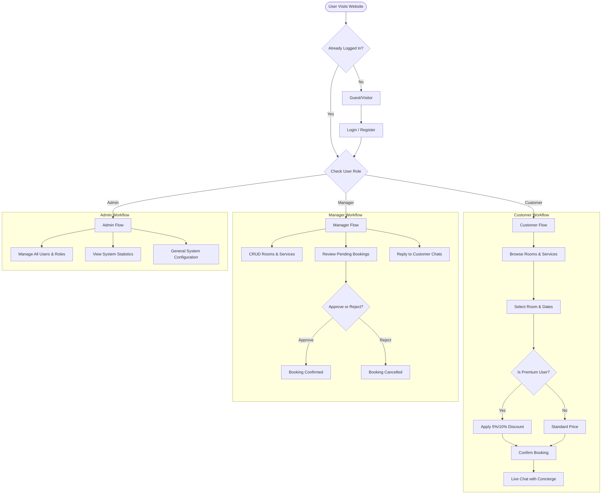

# Hotel Booking System - Flow Chart

This document describes the workflow of the Hotel Booking System. You can view this diagram in GitHub or any Markdown viewer that supports Mermaid.

## System Workflow

## How to use this for your DOCX file:
1. Copy the code block above.
2. Go to **[Mermaid Live Editor](https://mermaid.live/)**.
3. Paste the code in the left panel.
4. Download the generated diagram as a **PNG** or **SVG** image.
5. Insert the image into your `.docx` file.
